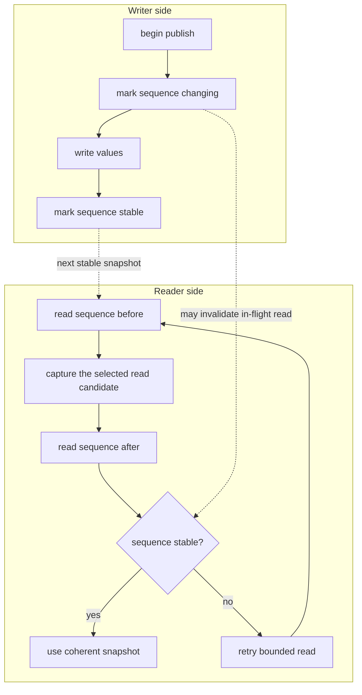

# Memory and Layout Model

The authored spec is not memory. `planLayout(spec)` is the lowering step that turns canonical fields into byte sizes, plane offsets, and a layout identity.

## Canonical Fields

Nested authored fields collapse to canonical dot keys before layout:

```text
params.filter.cutoff -> "filter.cutoff"
meters.engine.rms    -> "engine.rms"
```

The plan uses that canonical field set. Controller writes, snapshots, diagnostics, and generated examples should use the same keys.

## Plan First, Allocate Second

Allocation consumes a plan:

```ts
const plan = planLayout(spec);
const backing = allocatePacked(plan);
```

The binding layer does not silently re-plan. Passing a plan and backing that do not describe the same memory is a contract error.

## Planes

The implementation maps fields into typed planes for scalar and array storage. The exact plane names are implementation detail, but the public consequence is stable:

- Numeric param and meter fields map to typed shared-memory regions.
- Boolean and enum values have explicit storage representations.
- Array fields reserve fixed lengths at plan time.
- Parameter and meter publication uses seqlock-protected domains; processor
  parameter reads verify those sequences, and observer snapshots attempt
  bounded verification before applying their configured fallback policy.

## Seqlock-Checked Reads

Coherent snapshots are built around a small sequence check. The writer marks a sequence as changing, writes values, then marks it stable; the reader only uses a copied snapshot when the sequence is stable before and after the copy.



This is the mechanism behind processor parameter reads and observer snapshots.
Each attempt is bounded by a spin budget and a retry budget. Processor and
observer `params.within(...)` calls fail when they cannot obtain a coherent
candidate. Observer snapshots additionally apply their configured degradation
policy: the default may return a cached verified complete snapshot or a direct
unverified read. Configure `degrade: "throw"` to prohibit that fallback.
When a writer never becomes quiescent within the spin budget, strict reads fail
without invoking the candidate reader. A `returnLatest` observer invokes its
explicit degraded reader once only after verification fails.

Controller meter snapshots are different: they copy values directly and are
not seqlock-verified as a multi-field unit. Use a strict observer policy when
failed multi-field verification must throw.

## Backing Choices

| Allocation | Use |
| --- | --- |
| `allocatePacked(plan)` | One contiguous `SharedArrayBuffer`; the simplest handoff shape. |
| `allocatePartitioned(plan)` | Separate buffers per plane; useful when host integration wants plane-level separation. |
| `allocateWasm(plan, memory?)` | Allocate or attach compatible shared `WebAssembly.Memory`; useful for WASM-oriented runtimes. |

Only `packed` and `partitioned` backing are currently represented by the handoff protocol.

## Callback-Scoped Views

Array views in processor `params.within(...)`, controller `params.stage(...)`,
and processor meter `stage(...)` callbacks are ephemeral shared views. Do not
store them for later use. Observer snapshot and `params.within(...)` arrays are
detached copies created during the read attempt; those observer paths allocate.
