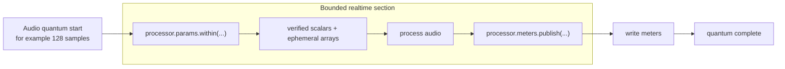

# Controller, Processor, and Observer Roles

SeqWire exposes separate role bindings because each side has different authority and timing pressure.

## Controller

The controller is the host-side writer for params and reader for meters. It usually lives with UI, automation, preset hydration, or orchestration code.

Controller responsibilities:

- Write one scalar param with `params.set(...)`.
- Write scalar micro-batches with `params.update(...)`.
- Write array params through the explicit `params.stage(...)` window.
- Hydrate cold-path scalar and array state with `params.hydrate(...)`.
- Read meter snapshots, using `snapshot({ into })` when array buffers should be reused.
- Own parameter range policy.

Controller meter snapshots are direct cold-path copies. They are useful for
single values and ordinary UI reads, but a multi-field controller snapshot is
not seqlock-verified as one coherent publication. Bind an observer when that
check is needed, and configure `degrade: "throw"` when failure must not fall
back to a best-effort snapshot.

## Processor

The processor is the timing-sensitive runtime binding. It reads params and publishes meters inside explicit callback windows.

Processor responsibilities:

- Read params inside `params.within(...)`.
- Use nested read aliases derived from the same spec.
- Treat array param views as callback-scoped.
- Publish scalar meters with direct writer functions or `writer.set(...)`.
- Publish exact schema meter groups with `meters.publishGroup(...)` or `writer.setGroup(...)`.
- Publish array meters with `writer.stage(...)`.
- Keep planning, allocation, validation, logging, and orchestration outside the tight loop.

## Realtime Quantum Flow

`within(...)` gives the processor seqlock-verified scalar values and
callback-scoped array views. Its spin and retry work is bounded; if the budget
is exhausted, the callback is not called and the read fails with a structured
error. Array views are live and ephemeral rather than detached coherent copies:
read or copy what you need, but do not retain them after the callback returns.
The binding constructs the view shape for each read, so `within(...)` is not a
zero-allocation API.

`publish(...)` writes meters back for the controller or an observer. The realtime section should stay bounded, synchronous, and allocation-conscious.

## Observer

The observer is a read-only binding for telemetry, inspection, visualizers, and secondary consumers.

Observer responsibilities:

- Attempt bounded seqlock-checked param and meter snapshots.
- Use `params.within(...)` when verification failure must throw without snapshot
  degradation.
- Avoid writes entirely.

Observer snapshot retries are bounded. The default `returnLatest` policy reuses
the last complete verified snapshot when one has been cached; a first or
partial snapshot can fall back to one direct unverified read. Observer snapshot
arrays are detached copies made during the read attempt. Use
`degrade: "throw"` and retain caller-owned last-good state when an unverified
fallback is unacceptable.

## Choosing a Role

| Need | Role |
| --- | --- |
| Update control state from UI or host automation. | Controller |
| Read control state in a timing-sensitive loop. | Processor |
| Publish runtime meters. | Processor |
| Feed diagnostics, visualization, or a HUD. | Observer |
| Own the memory plan and backing allocation. | Owner/controller side before binding |
